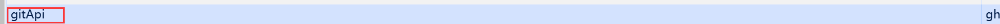

# 开发日志

## 功能需求

- 3d可视化组件
- 个人技能
- demo展示
- 博客，笔记
- 留言板+联系方式

## 2024.10.29

尝试用obj管理所有物体，在渲染循环下调用所有obj的update

## 2024.10.30

### 定义组件开发规范

- 组件只负责一件事情
- 组件间通过信号通信
- 组件内提供完成的参数设置接口

### 使用vuex模块化

1、子模块示例

```javascript
const visual3DModule = {
    namespaced: true,  
    state: () => ({
        isToggleAxes: true,
        isToggleGrid: true,
    }),
    mutations: {
        setAxesState(state, value) {
            state.isToggleAxes = value; 
        },
        setGridState(state, value) {
            state.isToggleGrid = value; 
        },
    },
    actions: {
        toggleAxesAction({ commit }, value) {
            commit('setAxesState', value); // 触发设置具体值的 mutation
        },
        toggleGridAction({ commit }, value) {
            commit('setGridState', value); // 触发设置具体值的 mutation
        },
    },
};

export default visual3DModule;
```

2、双向数据绑定示例

```javascript
const store = useStore();
const isToggleAxes = computed({
    get: () => store.state.visual3D.isToggleAxes,
    set: (value) => {
        store.dispatch('visual3D/toggleAxesAction', value); // 调用 Vuex action 设置新值
    }
});
const isToggleGrid = computed({
    get: () => store.state.visual3D.isToggleGrid,
    set: (value) => {
        store.dispatch('visual3D/toggleGridAction', value); // 调用 Vuex action 设置新值
    }
});
```

3、主store模板

```javascript
// src/store/store.js
import { createStore } from 'vuex';
import visual3DModule from './Visual3D'; // 引入模块

const store = createStore({
    modules: {
        visual3D: visual3DModule, // 注册模块
    },
});

export default store;

```

4、ref调用子组件方法

```javascript
<Visual3D :width="1024" :height="720" ref="visual" />

// 父组件
const visual = ref(null);

const onFileChange = (f) => {
    const file = f.raw;
    if (file) {
        const reader = new FileReader();
        reader.onload = (e) => {
            const jsonString = e.target.result;
            visual.value.loadSceneFromJson(jsonString); // 调用加载方法
        };
        reader.readAsText(file); // 读取文件为文本
    }
};

// 子组件
// 加载场景
const loadSceneFromJson = (jsonString) => {
    const loader = new THREE.ObjectLoader();
    const loadedScene = loader.parse(JSON.parse(jsonString)); // 从字符串加载场景
    // scence = null;
    scence.add(loadedScene); // 将加载的场景添加到当前场景中
};
// 让 loadSceneFromJson 方法可用于父组件
defineExpose({ loadSceneFromJson });
```

## 2024.11.9

暂存gitapi token在浏览器



### 总结

实现了基于vuex的组件间双向数据绑定

实现了父组件调用子组件的函数"git subtree push --prefix dist origin release" 
